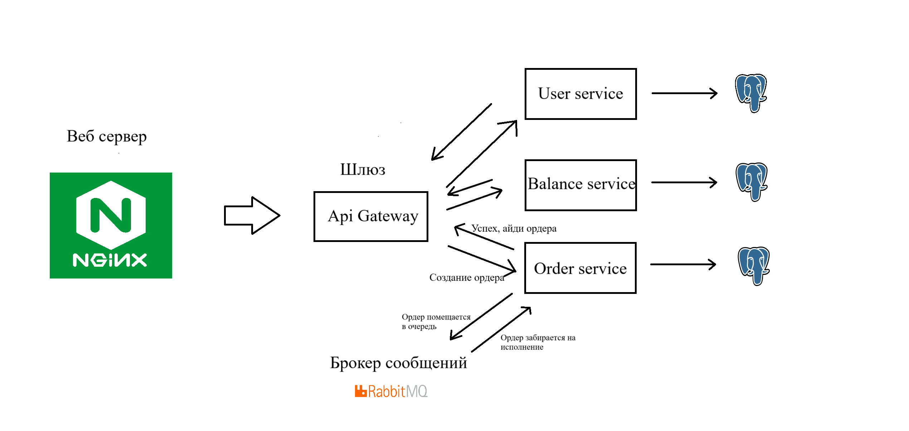

Запуск проекта осуществляется через docker compose (-docker compose up).

Учебный проект по курсу "Бекенд разработка на Python" от "Точки" 24/25. Стек: FastAPI, Postgresql, RabbitMq.
Сам проект представляет из себя серверную часть биржи и был сделан по заданной swagger схеме. 

Используется микросервисная архитектура, есть такие сервисы как: user, balance, order service. А также Api Gateway в качестве шлюза, который оркестрирует запросами к внутренним сервисам и выполняет аутентификацию пользователя. У каждого сервиса есть своя база данных в PostgreSql (в перспективе под каждый сервис можно поменять бд).
User service - предполагает логику работы с пользователями: авторизацию, удаление аккаунта.
Balance service - всё, что связано с балансом: депозит, вывод, транзакции. 
Order service - сервис, первостепенно предназначенный для обработки выполнения созданных ордеров, но также обрабатывает все эндпоинты, связанные с ордерами.
Сервисы коммуницируют между собой с помощью REST, что может и замедляет работу приложения, в сравнении с grpc, но решил выбрать именно REST, так как опыта работы с микросервисами не имел.
Для особых запросов, предполагающих цепную реакцию: удаление пользователя, инструмента, отмена ордера, реализовано общение через брокер сообщений RabbitMq.
Также RabbitMq задействован для фоновой обработки ордера, чтобы не заставлять пользователя ждать на загрузочном экране, а сразу выдать информацию о создании или ошибку в случае, когда баланс невалиден.
То бишь ордера сперва поступают в очередь и от туда достаются консюмером в order service.

Схема работы сервиса, а также пример обработки создания ордера:

Рассматривал проект не как проект для галочки, а как pet. Целью было на практике попробовать новые для себя технологии и закрепить старые.
